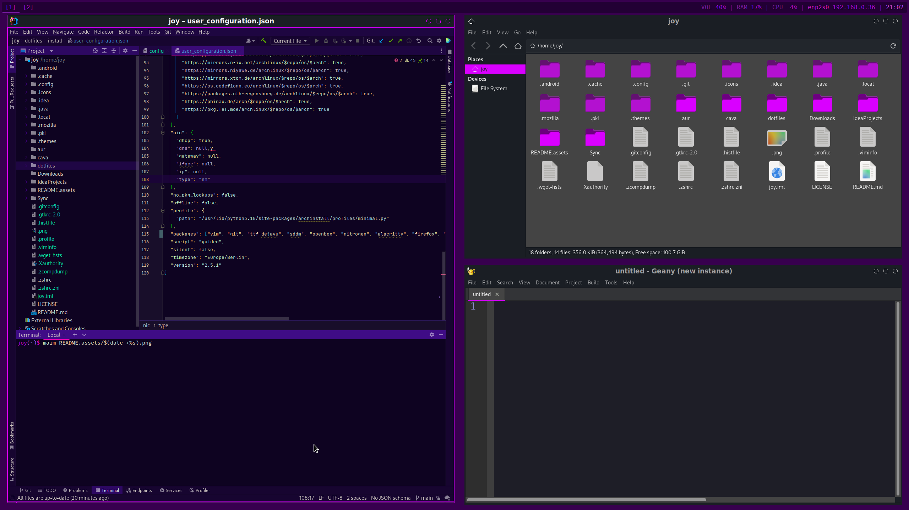
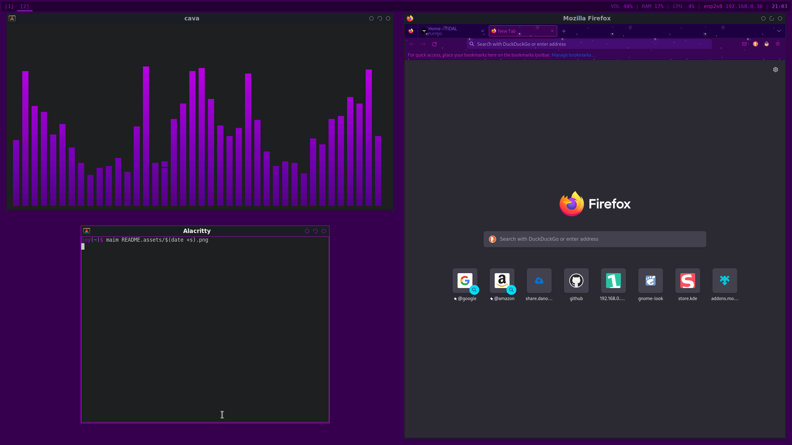

NOTE:  
This is the "General" Branch which will probl. Not recieve many Updates.  
Check the other branches for an updated version.

# Other stuff not in this repo:

- Firefox theme
  - https://addons.mozilla.org/en-US/firefox/addon/purple-twinkle/
- Jetbrains themes
  - https://plugins.jetbrains.com/plugin/16193-prpl-theme [screenshot]
  - https://plugins.jetbrains.com/plugin/16508-functional-purple-ui-theme [current]

# Image (contains extra stuff)
  


# Installation
(This is for myself in case I forget)
## On archiso
Install git:
```shell
loadkeys de
pacman -Sy
pacman -S git
```
Clone repository:
```shell
git clone https://github.com/Joyersch/dotfiles.git
```

Run `archinstall` with the config files (--silent gives me an error?!):
```shell
cd dotfiles/dotfiles
archinstall --config /install/user_configuration.json --creds /install/user_credentials.json --disk_layouts /install/user_disk_layout.json
```
Say no to chroot. Reboot.

## on System

Goto user repository (should already be there):
```shell
cd ~
```
Clone repository again:
```shell
git init
git remote add origin https://github.com/Joyersch/dotfiles.git
git pull origin main
```
Run install and build scripts:
```shell
sudo sh ~/dotfiles/install/base.sh
sh ~/dotfiles/install/aur-build.sh
sudo sh ~/dotfiles/install/aur-install.sh
chsh -s /usr/bin/zsh
```
