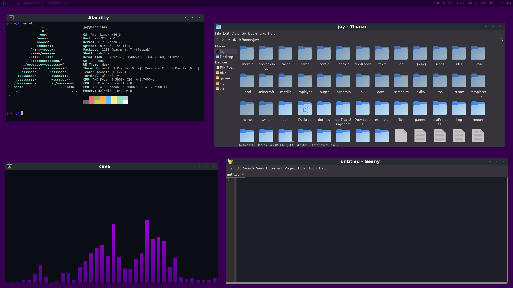
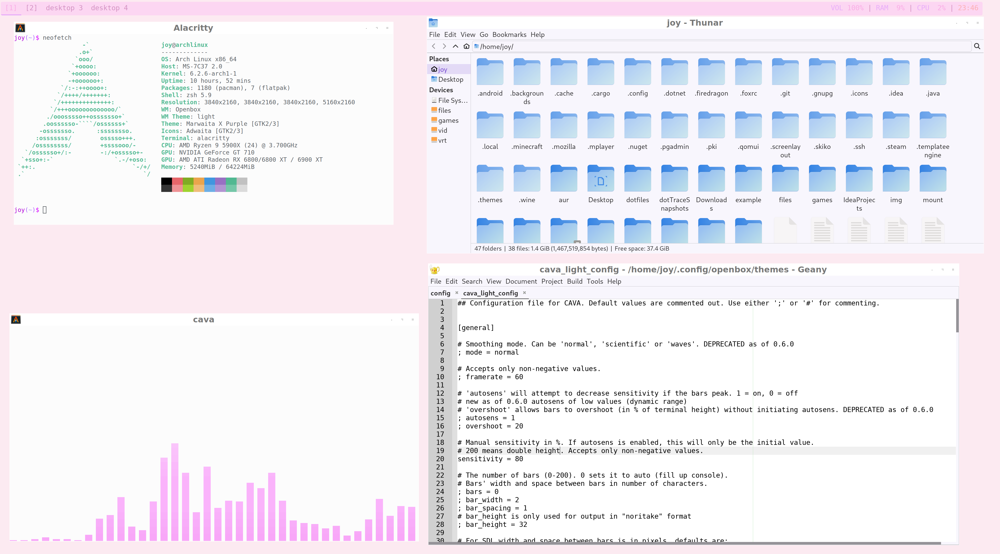

NOTE:  
This is the "Laptop" Branch which is for my laptop. 
Check the other branches for different versions.

# Images
  


# Themes for software:

- Jetbrains themes
  - https://plugins.jetbrains.com/plugin/12100-dark-purple-theme
  - https://plugins.jetbrains.com/plugin/16721-cute-pink-light-theme

# Installation
(This is for myself in case I forget)

## on System

Goto user repository (should already be there):
```shell
cd ~
```
Clone repository again:
```shell
git init
git remote add origin https://github.com/Joyersch/dotfiles.git
git pull origin main
```
Run install and build scripts:
```shell
sudo sh ~/install/install.sh
sh ~/install/cleanup.sh
```
